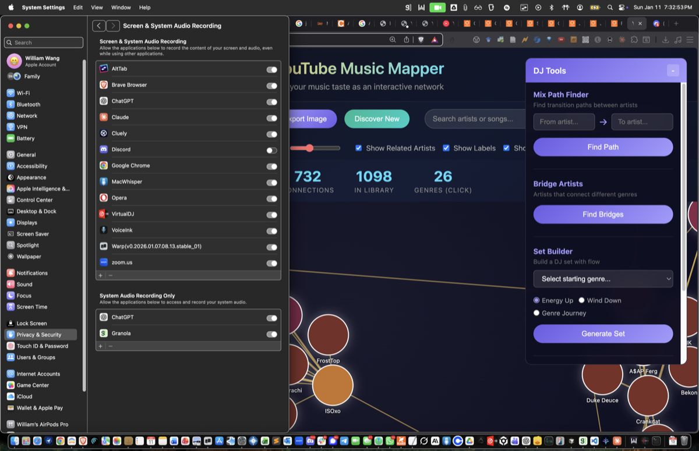

# YouTube Music Mapper

Visualize your YouTube Music library as an interactive network graph. See how artists connect through collaborations and similar styles, discover patterns in your music taste, and build DJ sets with smooth transitions.



## Features

- **Interactive Network Graph**: Artists displayed as nodes, connected by collaborations and style similarities
- **Genre Classification**: Automatic genre detection with color-coded nodes
- **Search & Filter**: Find artists/songs quickly, filter by genre
- **Artist Panel**: Click any artist to see their songs with year, view count, and your play history
- **DJ Tools**:
  - **Mix Path Finder**: Find transition paths between two artists
  - **Bridge Artists**: Discover artists that connect different genres
  - **Set Builder**: Auto-generate DJ sets based on energy flow or genre journey
  - **Export**: Export sets to text or Nicotine++ format for Soulseek searching

## Prerequisites

- Python 3.8+
- A YouTube Music account with liked songs

## Installation

1. **Clone the repository**
   ```bash
   git clone https://github.com/willwangfr/youtube-music-mapper.git
   cd youtube-music-mapper
   ```

2. **Install Python dependencies**
   ```bash
   pip install ytmusicapi flask requests
   ```

## Getting Your Data

### Option A: Google Takeout (Easier)

No API setup needed - just export your data from Google:

1. Go to [Google Takeout](https://takeout.google.com)
2. Click "Deselect all", then select only **"YouTube and YouTube Music"**
3. Click "All YouTube data included" and select:
   - **playlists** (includes your Liked Music)
   - **history** (your listening history)
4. Click "Next step" → "Create export"
5. Download and extract the ZIP file
6. Run the import:
   ```bash
   cd backend
   python import_takeout.py /path/to/Takeout
   ```

### Option B: YouTube Music API (More Data)

This method gets more metadata (album art, related artists) but requires auth setup:

1. **Authenticate with YouTube Music**
   ```bash
   cd backend
   ytmusicapi browser
   ```
   Follow the instructions to paste your request headers from YouTube Music.

2. **Fetch your data**
   ```bash
   python ytmusic_client.py
   ```

3. **Fetch song metadata (years and view counts)** *(optional)*
   ```bash
   python fetch_song_metadata.py
   ```
   Note: Makes API calls for each song, takes a few minutes for large libraries.

## Building the Graph

After importing your data (via either method):

```bash
cd backend
python assign_genres.py
python rebuild_graph.py
```

This creates `frontend/graph_data.json`.

## Running the App

1. **Start the backend server**
   ```bash
   cd backend
   python server.py
   ```
   Server runs on http://localhost:5050

2. **Open the frontend**

   Open `frontend/index.html` in your browser, or serve it:
   ```bash
   cd frontend
   python -m http.server 8000
   ```
   Then visit http://localhost:8000

## Usage

### Navigation
- **Pan**: Click and drag the background
- **Zoom**: Scroll wheel
- **Select Artist**: Click on a node to open the artist panel
- **Search**: Type in the search box to find artists or songs

### Controls
- **Node Size**: Adjust the size of artist nodes
- **Link Strength**: Adjust how tightly connected artists cluster
- **Show Related Artists**: Toggle visibility of artists not in your library
- **Show Labels**: Toggle artist name labels
- **Show Genres**: Toggle genre-based coloring

### DJ Tools
1. **Mix Path Finder**: Enter two artists to find a transition path between them
2. **Bridge Artists**: Click to find artists that connect different genres
3. **Set Builder**: Select a starting genre and flow type (Energy Up, Wind Down, or Genre Journey)
4. **Your Set**: Click songs to add them to your set, then export

### Export Options
- **Export**: Copy your set as text
- **Nicotine Export**: Export in "Artist - Song [Album]" format for Soulseek batch searching

## File Structure

```
youtube-music-mapper/
├── backend/
│   ├── server.py              # Flask API server
│   ├── import_takeout.py      # Import from Google Takeout
│   ├── ytmusic_client.py      # Fetch data from YouTube Music API
│   ├── assign_genres.py       # Genre classification
│   ├── fetch_song_metadata.py # Fetch years/views
│   ├── rebuild_graph.py       # Build graph data
│   ├── browser.json           # YTMusic auth (gitignored)
│   └── music_data.json        # Your music data (gitignored)
├── frontend/
│   ├── index.html             # Main page
│   ├── js/graph.js            # D3.js visualization
│   ├── css/styles.css         # Styling
│   └── graph_data.json        # Graph data for visualization
└── README.md
```

## Refreshing Your Data

To update with new liked songs:
```bash
cd backend
python ytmusic_client.py
python assign_genres.py
python fetch_song_metadata.py
python rebuild_graph.py
```

## Troubleshooting

**"Authentication failed" error**
- Re-run `ytmusicapi browser` to refresh your credentials

**Songs missing year/views**
- Re-run `fetch_song_metadata.py` - some API calls may have failed

**"Other" genre too high**
- Edit `assign_genres.py` to add more artists to the `ARTIST_GENRES` dictionary

## License

MIT
